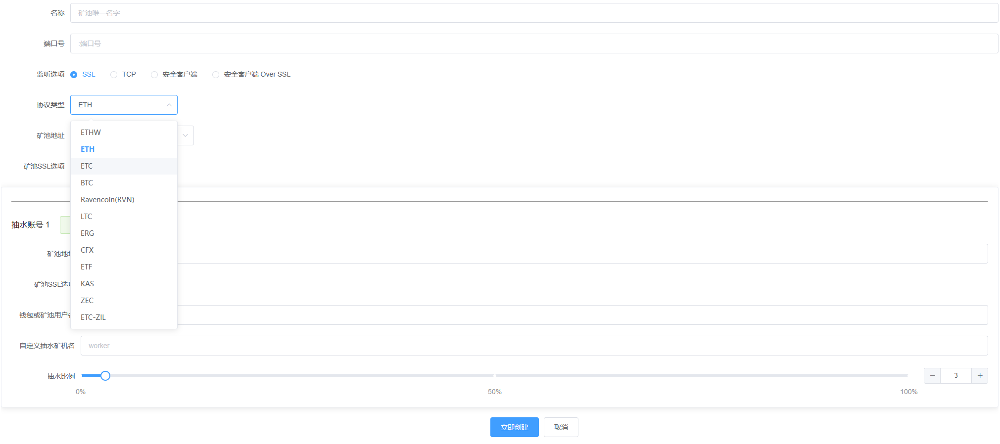

# 支持（ETHW-ETH-ETC-BTC-RVN-LTC-ERG-CFX-ETF-KAS-ZEC-CKB-NEXA-ETC-ZIL-IRON-DASH-DCR-KLS-ZEPH-BEL-BLOCX-OCTA-ZEN-GRIN-PYI-ALEPH-BCH-FB-ZEC）30+等新币种，这是一个免费软件，不收取任何费用。从技术角度来看，它只需要终端设备计算能力的0.2%作为技术回报。

###  **服务协议**

       MinerProxyJT受香港法律监管。请注意，不同国家/地区的法律要求可能会限制此类产品和服务。
       
       因此，该产品和服务以及某些功能可能不可用，或者在某些司法管辖区或地区或某些用户中可能受到限制。

       本产品并非VPN类型产品, 因为他无法使不允许地区访问禁止访问的内容。

       本产品为矿机、矿场管理软件，并非通过不正当手段获取矿机数据, 所有接入的设备均需设备拥有者主动设置矿机连接地址，以此确保任意使用本程序的客户拥有知情权。

       您不在任何恐怖活动组织及恐怖活动人员名单中，如联合国安理会决议中所列的恐怖活动组织及恐怖活动人员名单。

       您未被任何国家或地区的行政执法机构限制或禁止使用本程序。

       您非古巴、伊朗、朝鲜、叙利亚以及其他受到相关国家政府或国际机构执行制裁的国家或地区居民。

       您非限制或禁止开展数字货币相关活动国家或地区的居民，包括但不限于中国大陆地区等。

       您使用本程序提供的服务在您所在的国家或地区符合相关法律法规和政策。

       您同意：如因您所在国家或地区的法律法规和政策或其他任何适用法律的原因，导致您使用本程序的服务违法，您将独立承担相关法律风险和责任，您无条件且不可撤销地放弃向本程序进行追索的权利。

       您应该理解并遵守当地的法律法规。如果您使用此产品，默认代表将接受上述许可证。如果本产品引起的法律问题与本产品无关。

# MinerProxyJT使用一键代码安装
```bash
/bin/bash -c "$(curl -fsSL https://raw.githubusercontent.com/MINErpRroxY/MinerProxyJT/main/install.sh)"
```

# 矿工tg群： https://t.me/minerproxyjt

# 
# 请在安装新版本的时候，卸载干净之前服务器上存在的多种其他同类软件，可能程序上面的设置有部分冲突，导致软件不生效。（或者在一个新的服务器上面使用一键代码安装JT软件）

# 
# 请注意当前版本v1.6.59。币种连接可以选择有直接转发，设置为0。免费使用专业机本地端加密功能

# 

# MinerProxyJT - 界面展示，清晰整洁。

<p align="center">
    
  </p>

### **免责声明 (Disclaimer)**

#### **重要提示**

本项目为一款挖矿代理管理软件，旨在提供挖矿优化和连接支持功能。使用本软件即表示您同意以下所有条款和条件。

##### **法律责任声明**

1. ##### **用户合规性**

   本软件的使用必须严格遵守您所在国家或地区的法律法规。部分国家或地区禁止或限制加密货币挖矿活动，您有责任确保在您的国家或地区使用本软件的合法性。
   **开发者对任何因使用本软件而引发的法律问题概不负责。**

2. ##### **禁止非法用途**

   本软件仅限于合法使用，不得用于任何非法目的，包括但不限于：

   - 未经授权的挖矿；
   - 使用未经授权的硬件或网络资源；
   - 其他违反相关法律法规的行为。

#### **免责声明**

1. 本软件按 **"现状"**（"AS IS"）提供，开发者不对任何直接或间接因使用本软件而产生的后果负责，包括但不限于：数据丢失、硬件损坏、收益损失、法律诉讼等。
2. 本软件不提供任何形式的担保，包括适销性、特定用途的适用性以及无侵权性。
3. 开发者无义务对本软件进行维护、更新或修复可能存在的问题。

#### **用户责任**

1. 使用本软件前，您应全面了解相关法律法规，并自行承担使用本软件可能带来的所有风险和责任。
2. 若因使用本软件违反任何法律法规或第三方权益，责任完全由用户本人承担，与开发者无关。

#### **附加说明**

- 本免责声明可能随时更新，用户需自行查阅并遵守最新条款。
- 使用本软件即视为您已阅读、理解并同意本免责声明。
